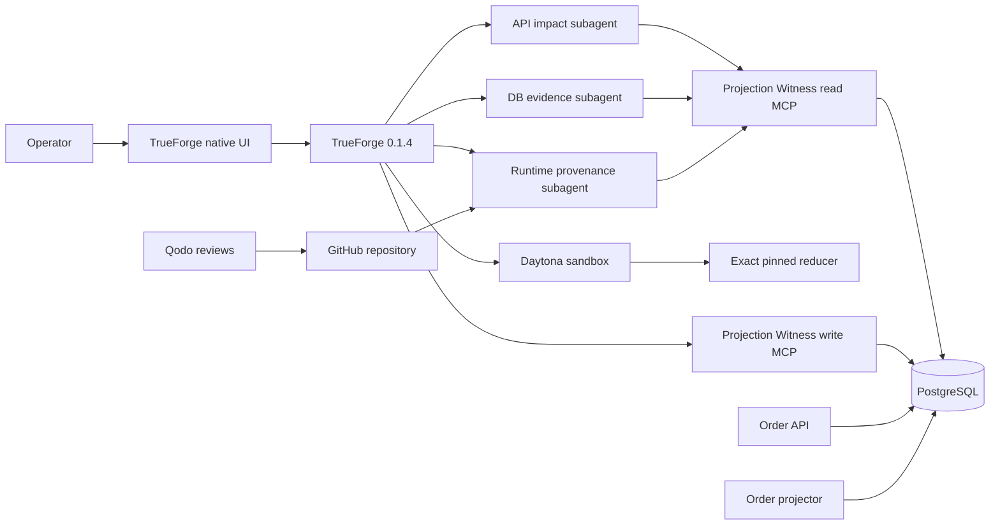

# Projection Witness - End-to-End Source of Truth

> Canonical product, architecture, security, implementation, testing, demo, and submission plan.

| Field | Value |
|---|---|
| Status | LOCKED FOR IMPLEMENTATION |
| Last verified | 2026-08-25 |
| Hackathon | WeMakeDevs + TrueFoundry Agent Harness Hackathon |
| Build window | 2026-08-24 through 2026-08-30 |
| Submission deadline | 2026-08-30 20:00 London / 19:00 UTC / 2026-08-31 00:30 IST |
| Team | Solo unless explicitly changed |
| Working product name | Projection Witness |
| Repository location | `C:\dev\ProjectionWitness` |
| Primary track target | Best Use of TrueForge |
| Secondary strength | Best Code Quality through Qodo evidence |

## 0. How To Use This Document

This file is the implementation authority for the hackathon project. It exists to prevent scope drift, unsafe shortcuts, and inconsistent claims.

Priority when sources conflict:

1. Official hackathon rules and current TrueForge/Qodo documentation.
2. Verified behavior from executable tests against pinned dependencies.
3. This document.
4. Implementation code and comments.

If code or a dependency disproves this document, do not silently work around the mismatch. Open a focused PR that:

1. States the disproved assumption.
2. Includes the executable evidence.
3. Updates this document and the implementation together.
4. Preserves the product promise and safety invariants, or explicitly triggers the kill gate.

The words MUST, MUST NOT, REQUIRED, SHOULD, and MAY are normative.

## 1. Final Product Decision

Build **Projection Witness**, a TrueForge agent that diagnoses and safely repairs exactly one corrupted event-sourced PostgreSQL read-model row.

The product promise is:

> Approval authorizes one precisely fingerprinted repair attempt. If the immutable stream, deployed reducer, or current projection row changes while the human decides, the operation refuses atomically and does not alter production state.

Plain-language pitch:

> A customer-facing order is wrong. Projection Witness proves the correct value from immutable history using the exact code production runs, asks a human to approve that exact repair, and refuses if reality changes before the write.

The innovation is **not event replay**. Existing systems already replay and rebuild projections. The innovation is an evidence-bound, time-of-check/time-of-use-safe, one-row repair transaction with a real approval boundary and post-write proof.

## 2. The Verified Pain

Globally tracked event projections can silently lose an event when transactions receive sequential global positions but commit out of order:

- Transaction A inserts position 10 and remains uncommitted.
- Transaction B inserts position 11 and commits first.
- The projector sees 11, advances its checkpoint to 11, and cannot see 10 yet.
- Transaction A commits position 10.
- A naive query for positions greater than 11 never returns 10.
- The read model remains wrong with no exception or failed job.

Ecotone documents this as silent data loss under production concurrency:

- https://docs.ecotone.tech/modelling/event-sourcing/setting-up-projections/gap-detection-and-consistency

Existing replay is not novel:

- Marten supports full projection rebuilds and `RebuildSingleStreamAsync`.
- Axon, Akka, Kafka Streams, and other systems support replay/reset workflows.
- Source: https://martendb.io/events/projections/rebuilding

The operational gap Projection Witness addresses is narrower:

- The bad row may be discovered long after the projector bug was fixed.
- A global rebuild can be expensive or operationally disruptive.
- Manual SQL does not prove the proposed value came from immutable history.
- A reviewed plan can become stale before a human approves it.
- Generic approval systems do not bind approval to the current stream, reducer, and row in one transaction.

## 3. Target User And Job

Primary user:

- An on-call backend engineer, platform engineer, or SRE operating a CQRS/event-sourced service.

Trigger:

- A customer report, support ticket, invariant alert, or reconciliation check shows a read model that disagrees with expected behavior.

Job to be done:

> Determine whether one projection row is provably wrong, derive the correct row without inventing business truth, repair it without overwriting concurrent work, and leave evidence another engineer can audit.

The first reference case is an order whose API still reports `AWAITING_PAYMENT` even though a committed `PaymentCaptured` event exists in its immutable stream.

## 4. Product Boundaries

### 4.1 In scope for the hackathon

- One TypeScript reference application.
- One PostgreSQL database.
- One `Order` event stream and one `order_view` projection.
- One real out-of-order commit failure path.
- One pure deterministic order reducer.
- One gap-aware projector version deployed before repair.
- One Streamable HTTP MCP server with narrow typed tools.
- One destructive tool: `apply_projection_repair`.
- TrueForge parallel subagents, Daytona sandbox, native approval, persisted session, and reconnect.
- Qodo review evidence on every implementation PR.
- Transactional one-row compare-and-swap repair plus append-only audit.
- Public API, database, and audit verification.

### 4.2 Explicitly out of scope

- Generic database repair.
- Arbitrary SQL generation or execution.
- Modifying or deleting immutable events.
- Inferring business truth from an LLM.
- Whole-projection rebuild orchestration.
- Multiple event-sourcing frameworks or databases.
- Kafka, Kubernetes, Grafana, PagerDuty, or a custom secret store.
- Multi-tenant production support beyond tenant-safe schema preparation.
- Automatic code deployment.
- Automatic approval.
- A custom agent chat application before the end-to-end path works.
- Semantic embeddings, vector databases, or unrelated AI features.

### 4.3 Allowed claims

- The failure mechanism is real and documented.
- The demo reproduces it through normal event writes and concurrent commits.
- The candidate row is produced by the pinned reducer, not the model.
- The approved plan is bound to stream, runtime, and row evidence.
- A stale plan is refused before production-state mutation.
- A successful repair updates one row and writes its audit record atomically.
- TrueForge is the runtime for tools, sandbox, subagents, approval, and reconnect.
- Qodo reviewed the implementation PR history when visible evidence exists.

### 4.4 Forbidden claims

- "Mathematically proves business truth."
- "Repairs any event-sourced system."
- "Prevents every projection bug."
- "Exactly once" unless the precise database boundary is stated.
- "Immutable audit" without explaining database permissions and append-only enforcement.
- "Production ready" before all production-readiness gates in this document pass.
- "Qodo approved" when only a configuration file exists and no review history is visible.
- "Daytona validated" when execution actually happened locally.
- "Real reconnect" when the turn was restarted rather than resumed from stored sequence state.

## 5. Definition Of Success

### 5.1 Hackathon success

The submission is complete only when all are true:

- A public repository exists and was built during the event window.
- The README contains reproducible setup and demo commands.
- A real TrueForge agent performs the workflow.
- A real owned/authorized MCP server is used.
- Daytona executes the exact reducer validation.
- Native TrueForge approval is visibly required before the repair tool runs.
- A client disconnect is resumed using the same session, turn, and sequence.
- A real PostgreSQL row is repaired and verified through the public API.
- A concurrent change makes an approved stale plan refuse with zero production-state mutation.
- Qodo reviews are visible from the first implementation PR onward.
- Tests, typecheck, lint, and build pass at the tagged submission commit.
- The three-minute video shows the working product, not slides pretending to be execution.
- The submission includes the required TrueForge usage explanation and AI-use disclosure.

### 5.2 Product success

The reference workflow must distinguish these outcomes:

| Outcome | Meaning | Production row write |
|---|---|---:|
| `NOT_PROVEN` | Evidence is incomplete or inconsistent | No |
| `ROOT_CAUSE_UNSAFE` | The broken projector is still active | No |
| `PLAN_READY` | Evidence converges and a plan is staged | No |
| `DENIED` | Human denied the native approval | No |
| `STALE_PLAN` | Stream, reducer, row, expiry, or plan changed | No |
| `NOOP_ALREADY_CORRECT` | Current row already equals the candidate | No |
| `APPLIED` | One row and one audit receipt committed atomically | Yes |
| `VERIFICATION_FAILED` | Apply committed but an external verification failed | No additional write; escalate |

## 6. Reference Domain

### 6.1 Events

The event types are intentionally small and typed:

```ts
type OrderPlaced = {
  type: "OrderPlaced";
  totalCents: number;
};

type PaymentCaptured = {
  type: "PaymentCaptured";
  paymentId: string;
  amountCents: number;
};

type OrderShipped = {
  type: "OrderShipped";
  shipmentId: string;
};
```

All monetary values MUST be non-negative safe integers in cents. Floating-point currency is forbidden.

### 6.2 Projection state

```ts
type OrderProjection = {
  orderId: string;
  totalCents: number;
  paidCents: number;
  paymentStatus: "AWAITING_PAYMENT" | "PARTIALLY_PAID" | "PAID";
  fulfillmentStatus: "NOT_SHIPPED" | "SHIPPED";
  lastStreamVersion: number;
};
```

`rowVersion` is storage concurrency metadata and is not controlled by the reducer.

### 6.3 Reducer contract

```ts
reduceOrder(previous: OrderProjection | null, event: OrderEvent): OrderProjection
```

The reducer MUST:

- Be pure and deterministic.
- Perform no I/O, clock reads, random generation, environment reads, or network calls.
- Validate event payloads before applying them.
- Reject unknown event types.
- Reject an invalid stream version sequence.
- Derive payment status only from integer totals.
- Be the same implementation used by the projector, sandbox, plan staging, and transactional apply path.

The LLM MUST NOT construct or edit the candidate row directly.

## 7. Genuine Failure Scenario

The demo fixture uses two orders and normal append transactions.

1. `ORD-1042` exists with `OrderPlaced(totalCents=12900)` and an `AWAITING_PAYMENT` view.
2. Transaction A appends `PaymentCaptured(12900)` to `ORD-1042` and receives global position `N`, then pauses before commit.
3. Transaction B appends an event to unrelated `ORD-2048`, receives `N+1`, and commits.
4. Naive projector v1 polls after the prior checkpoint, sees `N+1`, processes it, and advances to `N+1`.
5. Transaction A commits position `N`.
6. Naive projector polls `global_position > N+1`, so the payment event is skipped forever.
7. The events and stream head say `ORD-1042` is paid, but `GET /orders/ORD-1042` reports payment outstanding.
8. Gap-aware projector v2 is deployed. It prevents future gaps but cannot know the historical gap skipped before its deployment.
9. Projection Witness repairs the stranded row.
10. A later `OrderShipped` event proves the fixed projector continues correctly.

The deterministic race coordinator MAY pause Transaction A with a test barrier. It MUST NOT update `order_view` directly. Every event MUST enter through the real append function and transaction path.

```mermaid
sequenceDiagram
    participant A as Payment transaction A
    participant B as Unrelated transaction B
    participant DB as PostgreSQL
    participant P as Naive projector v1

    A->>DB: INSERT event at N, remain uncommitted
    B->>DB: INSERT event at N+1
    B->>DB: COMMIT
    P->>DB: SELECT position > checkpoint
    DB-->>P: N+1 only
    P->>DB: Process N+1 and set checkpoint N+1
    A->>DB: COMMIT N
    P->>DB: SELECT position > N+1
    DB-->>P: No rows; N is permanently skipped
```

## 8. System Architecture



### 8.1 Component ownership

| Component | Responsibility | Must not do |
|---|---|---|
| Order API | Domain writes, public order reads, runtime metadata | Repair projection rows directly |
| Projector v1 | Reproduce the naive checkpoint bug | Be used after root-fix deployment |
| Projector v2 | Gap-aware future event processing | Pretend to discover old unknown gaps |
| Reducer package | Deterministically derive order state | Perform I/O or use model output |
| Read MCP | Expose bounded authorized evidence | Expose arbitrary SQL or secrets |
| Write MCP | Stage and apply typed repair plans | Accept arbitrary tables, columns, or SQL |
| Daytona | Run exact reducer and focused verification | Receive database credentials |
| TrueForge | Agent loop, tools, subagents, approval, sessions | Be treated as the state-consistency mechanism |
| PostgreSQL transaction | Enforce freshness, locks, CAS, and atomic audit | Trust prior evidence without rechecking |
| Qodo | Review every implementation PR and generated regression PR | Be represented as runtime proof |

## 9. Repository Layout

Use npm workspaces and TypeScript ESM.

```text
ProjectionWitness/
|-- .github/
|   |-- pull_request_template.md
|   `-- workflows/ci.yml
|-- agents/
|   `-- projection-witness.agent.json
|-- apps/
|   |-- api/
|   |-- projector/
|   |-- mcp/
|   `-- demo-driver/
|-- packages/
|   |-- domain/
|   |-- reducer/
|   |-- evidence/
|   `-- database/
|-- db/
|   |-- migrations/
|   `-- seeds/
|-- skills/
|   `-- projection-repair/
|       `-- SKILL.md
|-- tests/
|   |-- unit/
|   |-- integration/
|   `-- e2e/
|-- scripts/
|   |-- bootstrap.ts
|   |-- reproduce-gap.ts
|   |-- register-agent.ts
|   |-- run-demo.ts
|   `-- reset-demo.ts
|-- docs/
|   |-- DEMO.md
|   |-- SECURITY.md
|   |-- TRUEFORGE.md
|   |-- QODO_EVIDENCE.md
|   |-- AI_DISCLOSURE.md
|   `-- VERSIONS.md
|-- .env.example
|-- .gitignore
|-- .pr_agent.toml
|-- docker-compose.yml
|-- package-lock.json
|-- package.json
|-- README.md
|-- SOURCE_OF_TRUTH.md
|-- tsconfig.base.json
`-- vitest.workspace.ts
```

No application package may import another application's private code. Shared behavior belongs in `packages/`.

### 9.1 Authority matrix

When two sources disagree, use this matrix. The agent may identify disagreement but may not redefine authority.

| Question | Authority | Corroborating evidence only |
|---|---|---|
| What domain events happened? | Immutable `events` rows for the stream | Logs, API output, model explanation |
| What is the stream head? | Locked `event_streams.version` plus validated event versions | Global checkpoint |
| What should the projection contain? | Exact attested reducer over the authoritative stream | Existing projection row |
| What does the customer currently see? | Public API response | Direct row read |
| What reducer is active? | Locked `projection_runtime` manifest plus matching loaded bundle digest | Git default branch |
| What was approved? | Persisted TrueForge `tool.approval_required` and approval response | MCP correlation fields |
| What repair was staged? | Immutable `projection_repair_plans` row and evidence digest | Agent prose |
| What repair committed? | `projection_repair_audit` row plus transaction result | Chat transcript |
| What code quality review occurred? | GitHub Qodo comments and review history | Local IDE output |

### 9.2 Required npm command contract

These command names are part of the developer interface and MUST be implemented:

| Command | Required behavior |
|---|---|
| `npm run db:up` | Start pinned PostgreSQL and wait for readiness |
| `npm run db:down` | Stop local services without deleting data unless explicitly documented |
| `npm run db:reset` | Recreate only the local demo database after confirmation/environment guard |
| `npm run db:migrate` | Apply ordered migrations once and report versions |
| `npm run dev:api` | Start the Order API |
| `npm run dev:projector:v1` | Start only the intentionally naive demo projector |
| `npm run dev:projector:v2` | Start the gap-aware projector and register its runtime manifest |
| `npm run dev:mcp` | Start both local MCP connectors |
| `npm run demo:reset` | Restore deterministic fixtures and expected IDs |
| `npm run demo:reproduce-gap` | Produce the real out-of-order commit failure |
| `npm run demo:verify` | Assert expected API, row, stream, runtime, plan, and audit state |
| `npm run test:unit` | Run isolated deterministic tests |
| `npm run test:integration` | Run real PostgreSQL integration tests |
| `npm run test:race` | Run repeated concurrency and stale-plan tests |
| `npm run test:e2e` | Run credentialed TrueForge/Daytona workflow when enabled |
| `npm run typecheck` | Strict no-emit TypeScript check for all workspaces |
| `npm run lint` | Lint all owned source |
| `npm run format:check` | Verify formatting without changing files |
| `npm run build` | Produce all application and reducer artifacts |

Scripts MUST be non-interactive in CI. Destructive local scripts MUST verify `NODE_ENV !== 'production'` and the database host is allowlisted as local/test.

### 9.3 Port contract

| Service | Default local port |
|---|---:|
| Order API | `3000` |
| Read MCP Streamable HTTP endpoint | `8781` |
| Write MCP Streamable HTTP endpoint | `8782` |
| TrueForge | `8790` |
| PostgreSQL | `5432` |

Ports may be overridden by environment variables. The final README must use the actual tested values.

### 9.4 Environment contract

The repository commits `.env.example`, never `.env`.

| Variable | Consumer | Secret | Purpose |
|---|---|---:|---|
| `DATABASE_URL_API` | API | Yes | Append/read role connection |
| `DATABASE_URL_PROJECTOR` | Projector | Yes | Projection worker role connection |
| `DATABASE_URL_MCP_READ` | Read MCP | Yes | Bounded evidence reads |
| `DATABASE_URL_MCP_WRITE` | Write MCP | Yes | Fenced repair transaction |
| `API_BASE_URL` | MCP/demo | No | Public verification endpoint |
| `API_PORT` | API | No | Defaults to `3000` |
| `MCP_READ_PORT` | MCP | No | Defaults to `8781` |
| `MCP_WRITE_PORT` | MCP | No | Defaults to `8782` |
| `TRUEFORGE_BASE_URL` | Demo client | No | Defaults to `http://localhost:8790` |
| `TRUEFORGE_AGENT_NAME` | Demo client | No | Saved agent name |
| `PROJECTION_NAME` | Projector/MCP | No | Fixed to `orders` in reference build |
| `PROJECTOR_MODE` | Projector | No | Explicitly `naive-v1` or `gap-aware-v1` |
| `SOURCE_COMMIT_SHA` | Runtime attestation | No | Built source revision |
| `REDUCER_BUNDLE_PATH` | Projector/MCP | No | Exact executable reducer bytes |
| `DEMO_MODE` | Demo driver | No | Must default to `false` |
| `PLAN_TTL_SECONDS` | MCP | No | Defaults to `300` for demo |
| `MAX_STREAM_EVENTS` | MCP | No | Bounded repair input |
| `MAX_STREAM_BYTES` | MCP | No | Bounded repair input |
| `DB_LOCK_TIMEOUT_MS` | Write MCP | No | Bounded lock wait |
| `DB_STATEMENT_TIMEOUT_MS` | All DB clients | No | Bounded query/transaction work |

Model credentials and the Daytona API key belong only in TrueForge settings. GitHub credentials belong only in the Qodo/GitHub/TrueForge connector configuration. They MUST NOT be mirrored into project environment variables unless a later optional GitHub-write feature requires a dedicated least-privilege token.

### 9.5 Coding conventions

- TypeScript `strict` mode is mandatory.
- Avoid `any`; use `unknown` plus validation at external boundaries.
- Use ESM consistently.
- Every database query is parameterized.
- Acquire one checked-out `pg` client for an entire transaction; always rollback on error and release in `finally`.
- No network, model, filesystem, or remote tool call may occur while the repair transaction is open.
- Inject clock and UUID generation where tests require determinism.
- Use `AbortSignal` or explicit timeout budgets for every external request.
- Logs are structured and redact configured secret fields.
- Comments explain invariants or non-obvious concurrency behavior, not syntax.
- Public schemas and error codes require tests before change.
- No generated artifact is described as proof unless its producer and digest are recorded.

## 10. Verified Toolchain Baseline

Verified from official registries on 2026-08-25:

| Dependency | Pin |
|---|---:|
| Node.js | `>=22.14`; use an exact Node 22 release and record it |
| `@truefoundry/trueforge` | `0.1.4` |
| `@truefoundry/trueforge-sdk` | `0.1.3` |
| `@modelcontextprotocol/sdk` | `1.30.0` |
| `zod` | `4.4.3` |
| `pg` | `8.23.0` |
| `vitest` | `4.1.11` |
| TypeScript | `5.9.3` unless a bootstrap incompatibility is proven |

Rules:

- Commit `package-lock.json`.
- Use exact dependency versions for the submission branch, not ranges.
- Record Node, npm, Docker, PostgreSQL image digest, TrueForge, SDK, Daytona configuration date, and model FQN in `docs/VERSIONS.md`.
- Never upgrade a major dependency after Day 3 unless it fixes a blocking defect and the entire validation matrix is rerun.
- Use a pinned PostgreSQL container image digest after the first successful integration run.
- Use npm because pnpm is not installed on the Windows host.
- In PowerShell, call `npm.cmd` if script execution policy blocks `npm.ps1`.

Suggested implementation dependencies that MUST be resolved and pinned in PR 1:

- A small HTTP framework or the MCP SDK's official HTTP adapter.
- A maintained RFC 8785 JSON canonicalization implementation.
- A formatter/linter such as Biome.
- `tsx` for development scripts only.

Do not invent versions in documentation. Record the installed exact versions after `npm install` succeeds.

## 11. Windows Development Strategy

The host OS is Windows. TrueForge's Windows compatibility PR #374 was still open when this document was written:

- https://github.com/truefoundry/trueforge/pull/374

Therefore:

1. The application and PostgreSQL SHOULD run through Docker Desktop and normal Windows Node tooling.
2. TrueForge SHOULD be launched through WSL2 with Node 22.14+ or another proven Linux environment.
3. Do not build TrueForge from source for the submission.
4. Verify that Windows can reach TrueForge at `http://localhost:8790`.
5. Verify that TrueForge can reach both MCP endpoints.
6. Daytona must receive case data through TrueForge/MCP or public repository artifacts, not by assuming it can access Windows `localhost`.
7. Record the exact working launch commands in `docs/TRUEFORGE.md` on Day 1.

Day-one environment checks:

```powershell
node --version
& "C:\Program Files\nodejs\npm.cmd" --version
docker version
docker compose version
wsl --status
```

Do not proceed to feature work until a trivial TrueForge turn, a trivial MCP read tool, and a Daytona `sandbox.created` event have all been observed.

## 12. Database Model

The migration files are the executable authority. The following schema defines their required semantics.

### 12.1 Event store

```sql
CREATE SEQUENCE event_global_position_seq AS bigint CACHE 1;

CREATE TABLE event_streams (
    stream_id text PRIMARY KEY,
    aggregate_type text NOT NULL,
    version integer NOT NULL CHECK (version >= 0),
    updated_at timestamptz NOT NULL DEFAULT clock_timestamp()
);

CREATE TABLE events (
    event_id uuid PRIMARY KEY,
    global_position bigint NOT NULL DEFAULT nextval('event_global_position_seq'),
    stream_id text NOT NULL REFERENCES event_streams(stream_id),
    stream_version integer NOT NULL CHECK (stream_version > 0),
    event_type text NOT NULL,
    payload jsonb NOT NULL,
    metadata jsonb NOT NULL DEFAULT '{}'::jsonb,
    recorded_at timestamptz NOT NULL DEFAULT clock_timestamp(),
    UNIQUE (global_position),
    UNIQUE (stream_id, stream_version)
);

CREATE INDEX events_stream_order_idx
    ON events (stream_id, stream_version);
```

Requirements:

- Event IDs are generated by the application with `crypto.randomUUID()`.
- Appends lock the relevant `event_streams` row with `FOR UPDATE`.
- Appends require an exact expected stream version.
- `events` rejects `UPDATE` and `DELETE` through permissions and a defensive trigger.
- Sequence values are allowed to have permanent holes after rollbacks.
- A stream fingerprint never assumes global positions are contiguous.

### 12.2 Projector state

```sql
CREATE TABLE projection_checkpoints (
    projection_name text PRIMARY KEY,
    last_global_position bigint NOT NULL DEFAULT 0,
    updated_at timestamptz NOT NULL DEFAULT clock_timestamp()
);

CREATE TABLE projection_gaps (
    projection_name text NOT NULL REFERENCES projection_checkpoints(projection_name),
    global_position bigint NOT NULL,
    first_observed_at timestamptz NOT NULL DEFAULT clock_timestamp(),
    PRIMARY KEY (projection_name, global_position)
);

CREATE TABLE order_view (
    order_id text PRIMARY KEY,
    total_cents bigint NOT NULL CHECK (total_cents >= 0),
    paid_cents bigint NOT NULL CHECK (paid_cents >= 0),
    payment_status text NOT NULL CHECK (
        payment_status IN ('AWAITING_PAYMENT', 'PARTIALLY_PAID', 'PAID')
    ),
    fulfillment_status text NOT NULL CHECK (
        fulfillment_status IN ('NOT_SHIPPED', 'SHIPPED')
    ),
    last_stream_version integer NOT NULL CHECK (last_stream_version > 0),
    row_version bigint NOT NULL DEFAULT 1 CHECK (row_version > 0),
    updated_at timestamptz NOT NULL DEFAULT clock_timestamp()
);
```

### 12.3 Runtime attestation

```sql
CREATE TABLE projection_runtime (
    projection_name text PRIMARY KEY,
    generation bigint NOT NULL CHECK (generation > 0),
    reducer_sha256 text NOT NULL CHECK (reducer_sha256 ~ '^[0-9a-f]{64}$'),
    source_commit_sha text NOT NULL,
    algorithm_version text NOT NULL,
    gap_strategy text NOT NULL,
    registered_at timestamptz NOT NULL DEFAULT clock_timestamp()
);
```

Rules:

- The projector registers its runtime manifest before becoming ready.
- A deployment update locks this row before changing generation or digest.
- Repair refuses unless `gap_strategy = 'TRACKED_NON_BLOCKING'`.
- Runtime registration is part of deployment readiness, not optional metadata.
- The reference system runs one active projector generation.

### 12.4 Repair plans

```sql
CREATE TABLE projection_repair_plans (
    plan_id uuid PRIMARY KEY,
    schema_version integer NOT NULL,
    projection_name text NOT NULL,
    stream_id text NOT NULL,
    stream_head_version integer NOT NULL,
    event_count integer NOT NULL,
    stream_sha256 text NOT NULL,
    runtime_generation bigint NOT NULL,
    reducer_sha256 text NOT NULL,
    source_commit_sha text NOT NULL,
    current_row_version bigint NOT NULL,
    current_row_sha256 text NOT NULL,
    current_row jsonb NOT NULL,
    candidate_row_sha256 text NOT NULL,
    candidate_row jsonb NOT NULL,
    evidence_sha256 text NOT NULL UNIQUE,
    status text NOT NULL CHECK (status IN ('PREPARED', 'APPLIED')),
    created_at timestamptz NOT NULL,
    expires_at timestamptz NOT NULL,
    applied_at timestamptz,
    CHECK (expires_at > created_at)
);
```

Plan staging is idempotent on `evidence_sha256`. A plan cannot be edited after creation. Database permissions and a trigger reject changes to evidence columns; the successful apply may change only `status` and `applied_at` in the same repair transaction.

### 12.5 Repair audit

```sql
CREATE TABLE projection_repair_audit (
    audit_id uuid PRIMARY KEY,
    plan_id uuid NOT NULL UNIQUE REFERENCES projection_repair_plans(plan_id),
    projection_name text NOT NULL,
    stream_id text NOT NULL,
    before_row jsonb NOT NULL,
    before_row_sha256 text NOT NULL,
    after_row jsonb NOT NULL,
    after_row_sha256 text NOT NULL,
    stream_sha256 text NOT NULL,
    reducer_sha256 text NOT NULL,
    runtime_generation bigint NOT NULL,
    trueforge_session_id text,
    trueforge_turn_id text,
    trueforge_tool_call_id text,
    correlation_trust text NOT NULL DEFAULT 'SUPPLIED',
    applied_at timestamptz NOT NULL DEFAULT clock_timestamp(),
    receipt_sha256 text NOT NULL UNIQUE
);
```

Important honesty boundary:

- In the local hackathon environment, TrueForge correlation identifiers supplied to MCP are correlation data, not authenticated identity.
- The authoritative human approval evidence remains in the persisted TrueForge event log.
- A production version requires authenticated MCP/OIDC identity before claiming the audit row identifies the approver.
- Audit rows reject `UPDATE` and `DELETE` through permissions and a defensive trigger.

### 12.6 Database role matrix

Use distinct login roles in local integration and demo environments. The migration owner is never used by a running service.

| Role | Required privileges | Explicitly forbidden |
|---|---|---|
| `pw_migrator` | Own schema, migrations, grants | Runtime use |
| `pw_api` | Select/insert events; select/insert/update stream heads; read order view/runtime public metadata | Event update/delete; projection repair; audit mutation |
| `pw_projector` | Select events/heads; update checkpoint/gaps/view/runtime registration | Event mutation; repair-plan/audit mutation |
| `pw_mcp_read` | Select bounded views, events, heads, runtime, plans, audit | All update/insert/delete operations |
| `pw_mcp_write` | Select/lock required rows; insert plans/audit; typed order-view update; allowed plan completion | Event mutation; schema DDL; unrelated tables; arbitrary SQL endpoint |

`pw_mcp_write` SHOULD eventually receive `EXECUTE` on a constrained database routine instead of direct table grants. For the hackathon, a Node-owned transaction is acceptable only if integration tests prove the same privilege boundary and exact fixed statements.

All pools MUST set a distinct PostgreSQL `application_name`, small maximum size, connection timeout, statement timeout, and idle-in-transaction timeout.

## 13. Normal Concurrency Contracts

### 13.1 Event append

Every append MUST:

1. Begin a transaction.
2. Insert or lock `event_streams(stream_id)` with `FOR UPDATE`.
3. Compare the supplied expected version with the locked version.
4. Insert the event with `stream_version = version + 1`.
5. Update the stream head.
6. Commit.

This serializes writes only within one stream. Different streams may commit out of global-position order, which is necessary to reproduce the real bug.

### 13.2 Projector update

Every projector row update MUST:

1. Validate the event payload.
2. Lock the projection row when it exists.
3. Require `last_stream_version = event.stream_version - 1`.
4. Apply the pure reducer.
5. Increment `row_version`.
6. Persist projector checkpoint/gap state in the same transaction where practical.

A delayed projector update for an event already represented by a repair must affect zero rows and become an idempotent no-op.

### 13.3 Gap-aware projector v2

Projector v2 MUST:

- Record newly observed missing global positions instead of silently skipping them.
- Continue processing available events from unrelated streams.
- Recheck recorded gaps on later polls.
- Remove a gap when its event becomes visible.
- Bound permanent sequence holes with an explicit age/offset cleanup policy.
- Preserve per-stream ordering with stream versions.
- Start from the existing checkpoint at deployment, which honestly explains why it cannot discover a historical unknown gap created by v1.

Repair MUST be refused while projector v1 or an unknown runtime generation is active.

## 14. Evidence And Fingerprints

### 14.1 Canonicalization

- Use a maintained RFC 8785 JSON Canonicalization Scheme implementation.
- Pin its exact version in PR 1.
- Add official conformance vectors plus project-specific vectors.
- Never hash raw `JSON.stringify(object)` output.
- Never include volatile fields such as query time in row fingerprints.
- Encode database `bigint` values as decimal strings before canonicalization.
- Hash with SHA-256 from `node:crypto`.

### 14.2 Stream fingerprint

The stream fingerprint covers the ordered canonical array of:

```ts
{
  eventId,
  globalPosition: string,
  streamId,
  streamVersion,
  eventType,
  payload,
  metadata,
  recordedAt
}
```

The stream evidence separately includes:

- Locked stream head version.
- Event count.
- First and last stream version.
- SHA-256 fingerprint.

### 14.3 Row fingerprint

The current-row fingerprint covers:

```ts
{
  orderId,
  totalCents: string,
  paidCents: string,
  paymentStatus,
  fulfillmentStatus,
  lastStreamVersion,
  rowVersion: string
}
```

`updated_at` is excluded because it is not business state and would create meaningless drift.

### 14.4 Reducer identity

The runtime manifest MUST include:

- Source commit SHA.
- Runtime generation.
- SHA-256 of the exact bundled reducer bytes loaded by the projector.
- Projector algorithm version and gap strategy.

The Daytona run MUST:

1. Obtain the exact commit or exact reducer artifact identified by the runtime manifest.
2. Rebuild or download the reducer using pinned dependencies.
3. Compare its digest with the runtime digest.
4. Abort on mismatch.
5. Run the reducer twice and require byte-identical canonical output.

If reproducible bundling cannot be achieved on Day 1, the fallback is to export the exact reducer bundle bytes through a bounded authorized artifact endpoint and run those bytes in Daytona. Calling current `main` "deployed" is forbidden.

### 14.5 Repair envelope

```json
{
  "schemaVersion": 1,
  "planId": "uuid",
  "projectionName": "orders",
  "stream": {
    "streamId": "ORD-1042",
    "headVersion": 2,
    "eventCount": 2,
    "sha256": "64 lowercase hex"
  },
  "runtime": {
    "generation": 2,
    "sourceCommitSha": "git sha",
    "reducerSha256": "64 lowercase hex",
    "algorithmVersion": "gap-aware-v1",
    "gapStrategy": "TRACKED_NON_BLOCKING"
  },
  "currentRow": {
    "rowVersion": "1",
    "sha256": "64 lowercase hex",
    "value": {}
  },
  "candidateRow": {
    "sha256": "64 lowercase hex",
    "value": {}
  },
  "invariants": [
    { "id": "stream_versions_contiguous", "passed": true },
    { "id": "reducer_deterministic", "passed": true },
    { "id": "candidate_matches_stream_head", "passed": true },
    { "id": "root_projector_fix_active", "passed": true }
  ],
  "createdAt": "ISO-8601",
  "expiresAt": "ISO-8601",
  "evidenceSha256": "hash of the envelope excluding this field"
}
```

Default plan expiry is five minutes. Tests MUST use an injected clock rather than sleeping.

## 15. Transactional Apply Contract

`apply_projection_repair` is the only production-state mutation available to the agent.

### 15.1 Tool input

The approval card must show, at minimum:

- `planId`
- `projectionName`
- `streamId`
- Old and proposed payment/fulfillment values
- Expected stream head and stream fingerprint
- Expected current row version and fingerprint
- Reducer generation and digest
- Evidence digest
- Expiry
- TrueForge session/turn/tool-call correlation when available

The server loads the persisted plan and rejects any input that disagrees with it.

### 15.2 Lock order

Every repair uses this exact lock order:

1. Repair plan row `FOR UPDATE`.
2. Runtime manifest row `FOR UPDATE`.
3. Stream-head row `FOR UPDATE`.
4. Projection row `FOR UPDATE`.

Deployment registration, event append, projector update, and repair code MUST use compatible lock ordering. A lock-order integration test is required.

### 15.3 Apply algorithm

```text
BEGIN
SET LOCAL lock_timeout = bounded value
SET LOCAL statement_timeout = bounded value

lock plan
if matching audit already exists:
    verify current row and return ALREADY_APPLIED

lock runtime manifest
lock stream head
lock projection row

validate plan schema and expiry
validate plan is PREPARED
validate runtime generation, reducer digest, source commit, and safe gap strategy
read immutable stream in stream-version order
recompute event count, stream head, and stream fingerprint
recompute current row fingerprint
load the exact local reducer bundle and verify its digest
recompute candidate from the locked stream
recompute candidate fingerprint

if any value differs from the staged plan:
    ROLLBACK
    return STALE_PLAN with mismatch categories and no sensitive values

if current row already equals candidate:
    ROLLBACK
    return NOOP_ALREADY_CORRECT

UPDATE order_view
  SET exact typed fields,
      last_stream_version = expected head,
      row_version = row_version + 1,
      updated_at = clock_timestamp()
  WHERE order_id = expected id
    AND row_version = expected row version

require exactly one updated row

INSERT projection_repair_audit with before, after, and evidence
UPDATE projection_repair_plans SET status = APPLIED, applied_at = clock_timestamp()

COMMIT
return APPLIED plus receipt
```

### 15.4 What "zero writes" means

For `STALE_PLAN`, `DENIED`, `NOT_PROVEN`, `ROOT_CAUSE_UNSAFE`, and expired plans:

- No `order_view` update.
- No repair-audit insert.
- No plan-status update.
- No event mutation.

Application logs may record a refusal outside the database, but the demo claim must be "zero production-state writes," not "nothing anywhere was logged."

### 15.5 Bounded work

The transaction MUST refuse cases exceeding configured limits:

- Maximum event count per repaired stream.
- Maximum canonical event bytes.
- Maximum reducer execution time.
- Maximum lock wait.
- Maximum transaction duration.

Reference defaults for the demo may be 1,000 events, 1 MiB canonical payload, 2 seconds reducer time, and 2 seconds lock wait. These values require measured confirmation before being described as production defaults.

## 16. MCP Surface

Use Streamable HTTP transport. Bind locally during development. Use two logical connectors so write exposure is obvious.

### 16.1 Read connector

| Tool | Purpose | Annotation |
|---|---|---|
| `find_projection_case` | Resolve an order ID or validate the reported case | Read-only |
| `get_public_order_state` | Read the customer-visible API result | Read-only, open-world |
| `inspect_projection_case` | Read projection row, checkpoint, gaps, and safe metadata | Read-only |
| `snapshot_event_stream` | Return bounded canonical events and stream evidence | Read-only |
| `get_projection_runtime` | Return deployed reducer/runtime attestation | Read-only |
| `stage_projection_repair` | Validate and persist an immutable plan | Write, non-destructive, explicitly ungated |
| `verify_projection_repair` | Verify row, API, audit receipt, and no-op state | Read-only |

### 16.2 Write connector

| Tool | Purpose | Annotation |
|---|---|---|
| `apply_projection_repair` | Revalidate and atomically repair one row | Write, destructive, idempotent |

Rules:

- No tool accepts SQL.
- No tool accepts a table or column identifier.
- Every input and output uses Zod schemas.
- Tool errors use stable codes and redacted messages.
- Tool results include bounded structured evidence, not persuasive prose.
- `apply_projection_repair` must be invoked as a direct tool call, never through Code Mode.
- The write connector has a database role limited to the required tables/procedure.
- Read tools have statement timeouts and row/byte limits.

## 17. TrueForge Agent Contract

Verified baseline:

- Server package: `@truefoundry/trueforge@0.1.4`
- SDK package: `@truefoundry/trueforge-sdk@0.1.3`
- Default local URL: `http://localhost:8790`
- Daytona is the only currently documented sandbox provider.
- Dynamic subagents run one level deep and in parallel.
- Subagents share root tools and sandbox.
- Tool approval policy is configured through the API.
- Session/turn events support sequence-based reconnect.

Official references:

- https://trueforge.dev/create-agent/overview
- https://trueforge.dev/key-features/subagents
- https://trueforge.dev/sandbox
- https://trueforge.dev/api/use-agent

### 17.1 Required saved-agent settings

```json
{
  "model": {
    "name": "VERIFIED_PROVIDER/MODEL",
    "params": {
      "temperature": 0.1,
      "parallel_tool_calls": true
    }
  },
  "instructions": "Stored in agents/projection-witness.agent.json",
  "mcp_servers": [
    {
      "name": "projection-witness-read",
      "enable_tools": ["@all"],
      "require_approval_for_tools": [],
      "preload": true
    },
    {
      "name": "projection-witness-write",
      "enable_tools": ["apply_projection_repair"],
      "require_approval_for_tools": ["apply_projection_repair"],
      "preload": true
    }
  ],
  "skills": [
    { "name": "projection-repair" }
  ],
  "config": {
    "sandbox": { "enabled": true, "file_downloads": true },
    "generative_ui": { "enabled": true },
    "ask_user_questions": { "enabled": true },
    "dynamic_sub_agents": { "enabled": true },
    "iteration_limit": 50
  }
}
```

The model FQN is an environment decision. It MUST be smoke-tested and recorded; do not commit provider secrets.

### 17.2 Root-agent responsibilities

The root agent MUST:

1. Clarify an ambiguous order identifier rather than guess.
2. Spawn focused evidence subagents when the case requires multiple planes.
3. Distinguish missing-event drift, reducer mismatch, row tampering, read-replica lag, and no provable defect.
4. Require the root projector fix before repair.
5. Require all envelope invariants to pass.
6. Never author the candidate row.
7. Present facts, mismatches, blast radius, and expiry before approval.
8. Call `apply_projection_repair` directly.
9. Verify through independent reads after apply.
10. Report limitations and failed checks plainly.

### 17.3 Subagent responsibilities

Suggested dynamic assignments:

| Subagent | Evidence plane | Required result |
|---|---|---|
| Impact investigator | Public API and reported symptom | Exact observed response and customer impact |
| Stream investigator | Events, stream head, projection row, checkpoint | Typed snapshots and mismatch categories |
| Runtime investigator | Runtime manifest, reducer digest, source commit | Provenance chain and safe-projector status |

The root agent sends the evidence bundle to Daytona only after identifiers agree.

Subagents MUST NOT call `apply_projection_repair`. Shared-tool access is a known TrueForge property; the explicit approval gate remains the enforcement boundary.

### 17.4 Daytona responsibilities

Inside the sandbox:

1. Materialize the bounded event snapshot.
2. Materialize or build the exact identified reducer.
3. Verify reducer digest.
4. Validate event schemas and contiguous stream versions.
5. Run the reducer twice.
6. Run focused reducer tests.
7. Compare candidate against current row.
8. Write `repair-envelope.json` and a human-readable summary.
9. Return hashes and artifact references to the root agent.

The sandbox MUST NOT receive `DATABASE_URL`, database passwords, model keys, GitHub write tokens, or Daytona credentials.

### 17.5 Native approval

The harness must emit `tool.approval_required` for `apply_projection_repair` before the tool executes.

An end-to-end test MUST assert:

1. Approval event observed.
2. Tool name and arguments match the staged plan.
3. Database fingerprint is unchanged before approval.
4. Denial produces no database mutation.
5. Allow invokes the write exactly once.

### 17.6 Real reconnect

Persist:

- `session.id`
- `turnId`
- `lastSequenceNumber`

On client restart:

1. Call `sessions.getTurn(sessionId, turnId)`.
2. If running, call `subscribeToTurn(..., { afterSequenceNumber })`.
3. If complete, rebuild from `listTurnEvents`.
4. Do not create a new turn while the original is running; that cancels it.

The demo must drop only the client connection. Cancellation or starting over does not count as reconnect.

### 17.7 Deterministic agent evaluation cases

Run the same saved agent against at least these cases and record results:

| Case | Expected agent behavior |
|---|---|
| Historical missing payment, safe runtime active | Build evidence and request exact approval |
| Projection already correct | Verify and finish with `NOOP_ALREADY_CORRECT` |
| Naive projector still active | Refuse with `ROOT_CAUSE_UNSAFE` |
| Runtime digest disagrees with repository | Refuse with `RUNTIME_UNATTESTED` |
| Stream has invalid version sequence | Refuse with `INVALID_EVENT_STREAM` |
| Ambiguous customer report | Ask the root user to choose; subagents must not guess |
| Event text contains agent instructions | Treat as data; do not change workflow or call write |
| Human denies approval | Report denial and verify no database change |
| Stream changes during approval | Invoke exact old plan, receive `STALE_PLAN`, then offer re-investigation |
| Public API remains wrong after commit | Report `VERIFICATION_FAILED`; do not claim success |

For each case, store the prompt, terminal outcome, required TrueForge events, and database before/after fingerprint. Model prose may vary; safety outcome may not.

## 18. Known TrueForge Risks And Mitigations

| Risk | Verified status on 2026-08-25 | Mitigation |
|---|---|---|
| Native Windows compatibility | PR #374 open | Run published package in WSL2/Linux; smoke-test Day 1 |
| Code Mode destructive-tool gate | Issue #318 open | Explicit annotations, literal approval policy, direct write call only, E2E approval assertion |
| Daytona snapshot registration timeout | Issue #417 open | Configure and prewarm early; avoid provider changes; bound our client timeout; keep retry runbook |
| Rapid TrueForge releases | 0.1.x packages | Pin server and SDK; no unplanned upgrade after Day 3 |
| Local mode exposure | Local instance may lack login | Bind to localhost only; use disposable least-privilege credentials |

References:

- https://github.com/truefoundry/trueforge/pull/374
- https://github.com/truefoundry/trueforge/issues/318
- https://github.com/truefoundry/trueforge/issues/417

No mitigation permits faking a required TrueForge or Daytona event.

## 19. Qodo Contract

Qodo is required strategically from the first implementation PR.

### 19.1 Setup

1. Create the public GitHub repository.
2. Install the official Qodo GitHub app before opening PR 1.
3. Enable code review on every push through the Qodo portal.
4. Enable persistent review comments and history.
5. Add CI and Qodo expectations to branch protection where supported.
6. Record installation and configuration evidence in `docs/QODO_EVIDENCE.md` without secrets.

Qodo documents that persistent review comments update on every push and preserve previous review history:

- https://docs.qodo.ai/code-review/persistent-review-comments

### 19.2 Required repository review rules

Every relevant PR description and review must check:

- Events are never updated or deleted.
- Money is represented as validated integer cents.
- Reducer is pure and deterministic.
- Hash inputs are canonical and versioned.
- Apply accepts no arbitrary SQL or identifiers.
- Transaction lock order is unchanged.
- Stream, runtime, row, candidate, expiry, and plan are rechecked after locks.
- Repair update and audit insert are atomic.
- Stale, denied, expired, and no-op paths write no production state.
- Secrets never enter model prompts, logs, repository, or sandbox.
- Tool output and event payloads are treated as untrusted data.
- Tests cover the failure before accepting the fix.

### 19.3 Review workflow

For every PR:

1. Open a focused PR against protected `main`.
2. Wait for CI and Qodo.
3. Classify each Qodo finding as fixed, technically rejected with evidence, or deferred with explicit risk.
4. Push corrections and allow Qodo to review the new commit.
5. Merge only when CI is green and no unresolved high-risk finding remains.
6. Link the review in `docs/QODO_EVIDENCE.md`.

An installed configuration without visible review comments is not sufficient evidence.

## 20. Security And Trust Model

### 20.1 Trusted inputs

- PostgreSQL transaction and lock semantics.
- Immutable event rows under restricted database roles.
- Pinned reducer bytes whose digest matches runtime attestation.
- Zod-validated typed schemas.
- TrueForge persisted approval event for the local demo.

### 20.2 Untrusted inputs

- User prompts.
- LLM reasoning and prose.
- Event payload text until schema validation.
- MCP arguments supplied by the model.
- GitHub content and README instructions.
- Tool output rendered to the model.
- Client-supplied TrueForge correlation identifiers.
- Previously staged evidence at apply time.

### 20.3 Threats and required controls

| Threat | Control |
|---|---|
| Prompt injection in event or repository content | Treat all retrieved content as data; deterministic code controls candidate and write |
| Hallucinated candidate | Candidate accepted only from exact reducer execution |
| Plan tampering | Persist plan, canonical digest, server-side recomputation |
| Approval replay | One successful audit per plan; plan expiry; idempotent result |
| Concurrent event append | Shared stream-head row lock and stream fingerprint recheck |
| Concurrent projector update | Projection-row lock plus row-version CAS and stream-version semantics |
| Deployment during approval | Runtime-generation row lock and digest recheck |
| SQL injection | Fixed parameterized SQL; no identifier or SQL tool arguments |
| Over-broad database access | Separate read/write roles and least privilege |
| Secret leakage to Daytona | No infrastructure credentials in sandbox |
| Sensitive logs | Structured redaction; no tokens, connection strings, or full PII |
| Partial repair | Projection update, audit insert, and plan completion in one transaction |
| Audit alteration | No update/delete grant plus defensive trigger |
| Denial bypass | Literal TrueForge approval policy and E2E event assertion |
| Oversized stream denial of service | Event-count, byte, time, and lock limits |

### 20.4 Rollback policy

Never delete a repair audit or mutate events to "undo" a repair.

If a repair itself is wrong:

1. Treat the current row as new evidence.
2. Stage a new plan from the unchanged event stream and correct reducer.
3. Require a new native approval.
4. Apply a new audited CAS repair.

History remains append-only.

## 21. API Surface

Reference application endpoints:

| Method | Path | Purpose |
|---|---|---|
| `GET` | `/healthz` | Process health only |
| `GET` | `/readyz` | Database and runtime registration readiness |
| `GET` | `/meta` | Public-safe source commit, reducer digest, projector generation |
| `GET` | `/orders/:orderId` | Customer-visible projection read |
| `POST` | `/orders/:orderId/payments` | Normal expected-version domain append |
| `POST` | `/orders/:orderId/shipments` | Normal expected-version domain append |

Demo-only operations belong in scripts or a separately enabled demo driver, not the production API:

- Reset deterministic fixture.
- Start/pause/release the concurrent transaction barrier.
- Run one projector poll.
- Switch from projector v1 to v2.

`DEMO_MODE` defaults to false. Production entrypoints must not expose race-control operations.

## 22. Error Contract

Stable error codes:

| Code | HTTP/MCP meaning | Retry behavior |
|---|---|---|
| `CASE_NOT_FOUND` | Unknown order/stream | Correct identifier |
| `AMBIGUOUS_CASE` | Multiple matches | Ask user |
| `INVALID_EVENT_STREAM` | Schema/version/invariant failure | Escalate; no repair |
| `RUNTIME_UNATTESTED` | Missing or mismatched runtime identity | Fix deployment attestation |
| `ROOT_CAUSE_UNSAFE` | Gap-aware projector not active | Deploy root fix first |
| `PLAN_INVALID` | Envelope or digest mismatch | Recompute |
| `PLAN_EXPIRED` | Approval evidence too old | Recompute |
| `STALE_PLAN` | Live evidence changed | Recompute; do not auto-retry apply |
| `LOCK_TIMEOUT` | Could not obtain bounded locks | Retry investigation later |
| `NOOP_ALREADY_CORRECT` | Row equals candidate | Verify only |
| `ALREADY_APPLIED` | Plan audit already exists | Return receipt idempotently |
| `APPLY_FAILED` | Transaction rolled back | Escalate with redacted diagnostics |
| `VERIFICATION_FAILED` | External checks disagree after commit | Escalate; do not hide success or failure |

Do not return raw database errors, SQL, credentials, or stack traces through MCP.

## 23. Test Strategy

### 23.1 Unit tests

- Every event type and reducer transition.
- Invalid and unknown events.
- Integer-money boundaries.
- Reducer determinism.
- Canonicalization conformance vectors.
- Stream, row, candidate, envelope, and receipt digests.
- Zod schemas for every API and MCP boundary.
- Plan expiry with injected clock.
- Error-code mapping and redaction.
- Agent-output parsing where deterministic code consumes it.

### 23.2 PostgreSQL integration tests

- Expected-version append success and conflict.
- Real out-of-order commits produce the missed event.
- No direct mutation is used to create the bad row.
- Event update/delete rejection.
- Gap-aware projector catches a new post-deployment gap.
- Gap-aware projector honestly does not infer the historical v1 gap.
- Successful one-row repair.
- Stream changes after staging -> `STALE_PLAN`.
- Row changes after staging -> `STALE_PLAN`.
- Runtime generation changes after staging -> `STALE_PLAN`.
- Reducer digest changes after staging -> `STALE_PLAN`.
- Expired plan -> no write.
- Candidate tampering -> no write.
- Concurrent append waits or makes plan stale without lost update.
- Concurrent projector update cannot overwrite repaired state.
- Audit-insert failure rolls back projection update.
- Projection-update failure writes no audit.
- Same plan is idempotent.
- Already-correct row is a no-op.
- Lock order does not deadlock under repeated contention.
- Transaction and lock timeouts are bounded.

### 23.3 MCP contract tests

- Tool discovery exposes only documented tools.
- Read tools carry correct read-only annotations.
- Apply carries explicit destructive/write annotations.
- Inputs reject extra fields where safety requires strict schemas.
- No arbitrary SQL or identifiers are accepted.
- Tool results respect row/byte bounds.
- Stable errors are redacted.
- Write connector cannot use the read-only database role.

### 23.4 TrueForge/Daytona end-to-end tests

- Real `mcp.initialize` observed.
- Three real `thread.created` events observed.
- Real `sandbox.created` observed.
- Reducer command runs in Daytona, not local shell.
- `tool.approval_required` precedes apply.
- Database fingerprint does not change before approval.
- Denial leaves database unchanged.
- Client disconnect resumes using `afterSequenceNumber`.
- Stale approved plan is refused.
- Fresh approved plan applies once.
- API, row, audit, and no-op verification pass.

### 23.5 Demo reliability gate

- Reset and full demo run are deterministic.
- Full demo succeeds ten consecutive times from clean reset.
- Stale-plan branch succeeds ten consecutive times.
- No manual database editing occurs between steps.
- Total narrated path fits within three minutes.
- A screen recording backup exists, but the product remains genuinely runnable.

## 24. CI Gates

Every PR must run:

```text
npm ci
npm run format:check
npm run lint
npm run typecheck
npm run test:unit
npm run test:integration
npm run test:race
npm run build
```

CI requirements:

- Node 22 exact version.
- Real PostgreSQL service container.
- Fresh schema per run.
- No production or Daytona credentials.
- Test timeout budgets.
- Coverage reported, but no arbitrary percentage replaces behavioral gates.
- Upload useful redacted diagnostics on failure.

The external TrueForge/Daytona test may be a manually triggered workflow because it requires credentials. Its final successful run and logs must be recorded before submission.

## 25. Implementation PR Sequence

Keep each PR reviewable and let Qodo inspect the dangerous changes separately.

| PR | Scope | Required proof before merge |
|---:|---|---|
| 1 | Repository, toolchain, Qodo, CI, versions | Qodo visible; all empty-project gates pass |
| 2 | Domain events, reducer, Postgres event store | Unit/integration append tests pass |
| 3 | Naive projector and genuine race reproducer | API is wrong through real race; ablation test proves mechanism |
| 4 | Gap-aware projector and runtime attestation | Future gap caught; old gap remains; unsafe runtime refusal |
| 5 | Evidence schemas, canonical hashes, Daytona runner | Exact reducer digest and deterministic envelope |
| 6 | Repair plans and transactional apply | All stale/CAS/atomicity tests pass |
| 7 | MCP read/write connectors | Contract, annotation, permission, and redaction tests |
| 8 | TrueForge agent, subagents, approval, reconnect | Required real events captured |
| 9 | End-to-end verification, docs, demo | Ten clean runs; no unresolved Qodo high-risk findings |

Do not combine PRs 3, 5, 6, and 8. They are the key judging evidence.

## 26. Daily Plan And Exit Gates

The current date is 2026-08-25. There is not a fresh seven-day window. Work must finish before the official 2026-08-30 deadline.

### Day 1 - August 25: Foundation and real failure

Deliver:

- Public repository and Qodo installation.
- npm workspaces, CI, Docker PostgreSQL, migrations.
- Typed order reducer and API.
- Append path with expected versions.
- Naive projector v1.
- Deterministic concurrent-commit reproducer.
- API visibly wrong while immutable events are correct.
- TrueForge 0.1.4, SDK 0.1.3, trivial MCP, and Daytona smoke tests.

Exit gate:

- PRs 1 through 3 are merged with Qodo evidence.
- The failure is reproduced without direct projection mutation.
- Real `sandbox.created` has been observed.

Kill immediately if the real gap cannot be produced reliably.

### Day 2 - August 26: Safety core

Deliver:

- Gap-aware projector v2.
- Runtime attestation and unsafe-runtime refusal.
- Canonical fingerprints and envelope schemas.
- Repair-plan persistence.
- Transactional apply with fixed lock order.
- Stream, row, runtime, expiry, and candidate stale tests.
- Atomic audit and idempotency.

Exit gate:

- A staged plan applies exactly once.
- A concurrent append after staging returns `STALE_PLAN`.
- Projection row and audit remain unchanged on stale refusal.
- Audit failure rolls back row update.

If atomic stale refusal is not working by the end of Day 2, stop this project rather than replacing it with a UI simulation.

### Day 3 - August 27: Agent and sandbox

Deliver:

- MCP read and write connectors.
- Exact tool schemas and annotations.
- Projection-repair skill.
- Saved TrueForge agent registration script.
- Three focused subagents.
- Daytona exact-reducer execution and artifact digest check.
- Staged evidence shown in the native TrueForge UI.

Exit gate:

- A user symptom reaches `PLAN_READY` without hard-coded agent output.
- Three real subagent threads and one real sandbox event are visible.
- The candidate was created only by the reducer.

### Day 4 - August 28: Approval, reconnect, verification

Deliver:

- Literal TrueForge approval policy for the write tool.
- Approval-event assertion.
- Deny path.
- Client disconnect and sequence-based reconnect.
- Stale approval demo.
- Fresh approval success.
- API, database, audit, and no-op verification.

Exit gate:

- Full ugly end-to-end demo works without manual intervention.
- No database mutation occurs before approval.
- Disconnect resumes the same turn.

### Day 5 - August 29: Hardening and presentation

Deliver:

- Complete adversarial test matrix.
- Least-privilege roles and redaction review.
- Resolve or document every Qodo finding.
- README quickstart.
- `SECURITY.md`, `TRUEFORGE.md`, `QODO_EVIDENCE.md`, and AI disclosure.
- Three-minute demo script and first recording.
- Ten consecutive full runs.
- Current entrant collision refresh.

Exit gate:

- Submission candidate tag can be cut without adding features.

### Day 6 - August 30: Freeze and submit

Internal targets:

- Code freeze: 14:00 UTC / 19:30 IST.
- Final video and write-up: 17:00 UTC / 22:30 IST.
- Submit by: 18:00 UTC / 23:30 IST.
- Official hard deadline: 19:00 UTC / 2026-08-31 00:30 IST.

Only release-blocking fixes after code freeze. Rerun all gates after any change.

## 27. Three-Minute Demo Script

Target length: 2:45 to leave margin.

### 0:00-0:20 - Pain

- Show `GET /orders/ORD-1042` returning `AWAITING_PAYMENT` and `paidCents: 0`.
- Show the customer payment/event exists.
- Say: "A production concurrency race silently skipped this event. No job failed."

### 0:20-0:55 - Investigation

- Ask Projection Witness: "Why does ORD-1042 still show payment due?"
- Show three TrueForge subagent threads.
- Show API, database, and deployed-runtime evidence converging.

### 0:55-1:20 - Deterministic proof

- Show real `sandbox.created`.
- Show Daytona running the exact reducer digest over the fingerprinted stream.
- Show old state, proposed state, stream hash, reducer hash, row hash, and expiry.

### 1:20-1:40 - Real reconnect

- Drop the demo client connection.
- Restart it with stored session, turn, and sequence.
- Show no duplicated events and the same pending plan.

### 1:40-2:05 - Stale approval refusal

- While approval is pending, append a legitimate event.
- Click Allow on the old approval.
- Show `STALE_PLAN` and zero production-state writes.
- Say: "Approval was for that evidence, not whatever happens to be current."

### 2:05-2:35 - Fresh repair

- Let the agent recompute evidence.
- Approve the fresh exact repair.
- Show one-row CAS update and audit receipt.
- Show public API now reports `PAID`.

### 2:35-2:55 - Verify quality

- Show rerun returns `NOOP_ALREADY_CORRECT`.
- Show Qodo review history and green CI.
- End with: "The model investigates. Immutable history and transactional checks decide what may be written."

Do not spend demo time on dependency lists or architecture slides.

## 28. Rubric Mapping

| Criterion | Evidence judges see |
|---|---|
| Impact | Documented silent projection loss; wrong customer-facing payment state; surgical alternative to manual SQL/global rebuild |
| Originality | Approval bound to stream + deployed reducer + row, with atomic stale-plan refusal |
| Technical excellence | Real concurrency bug, pure reducer, canonical hashes, lock order, CAS, atomic audit, adversarial tests |
| Sponsor tools | TrueForge MCP, Daytona, parallel subagents, native approval, persisted reconnect; Qodo PR trail |
| Control and safety | One typed write, no arbitrary SQL, least privilege, expiry, denial, stale refusal, no-op, audit |
| Presentation | Clear wrong -> investigate -> prove -> stale refusal -> fresh repair -> verify story |

## 29. Production Evolution After The Hackathon

The reference implementation is production-shaped but not yet a general product.

Reasonable evolution:

1. Define a projection-adapter interface for stream reads, row snapshots, reducer artifacts, lock contracts, and typed writes.
2. Add authenticated MCP/OIDC identity and signed approval correlation.
3. Add deployment attestation from OCI image/SBOM provenance.
4. Add tenant isolation and policy controls.
5. Add framework adapters one at a time, each with conformance tests.
6. Add drift detection integrations that open cases but never auto-repair.
7. Add retention and export policy for plans/audits.
8. Add operational metrics and alerting.

Potential metrics:

- Investigation count by outcome.
- `NOT_PROVEN` and `STALE_PLAN` rates.
- Plan age at approval.
- Lock wait and transaction duration.
- Repair success and verification-failure count.
- Event count and bytes per case.

Never emit event payloads, customer identifiers, connection strings, or candidate rows as metric labels.

## 30. Required Documentation

### README.md

- One-sentence product statement.
- Thirty-second architecture explanation.
- Prerequisites.
- Exact setup commands.
- Exact demo/reset commands.
- Safety guarantees and limitations.
- TrueForge and Qodo usage.
- Links to this document and security notes.
- License and AI-use disclosure link.

### docs/SECURITY.md

- Trust boundaries.
- Database roles.
- MCP authentication limitations.
- Threat model.
- Secret handling.
- Incident/rollback policy.

### docs/TRUEFORGE.md

- Exact version and launch command.
- Agent manifest.
- Connector configuration.
- Daytona configuration.
- Approval policy.
- Reconnect implementation.
- Captured event evidence.
- Known upstream issues and mitigations.

### docs/QODO_EVIDENCE.md

- Installation date.
- Review-every-push setting.
- PR links.
- Material findings and resulting fixes.
- Technical disagreements with evidence.

### docs/AI_DISCLOSURE.md

- AI tools used.
- What they generated or reviewed.
- Human verification performed.
- Explicit statement that the team understands and tested submitted code.

### docs/DEMO.md

- Reset procedure.
- Expected IDs and outputs.
- Narration with timestamps.
- Recovery steps for non-product demo failures.

## 31. Submission Checklist

- [ ] Every team member is registered; solo status is correct.
- [ ] Public repository created during the event window.
- [ ] OSI-compatible license included.
- [ ] No secrets in Git history, issues, actions, screenshots, or video.
- [ ] README setup succeeds from a fresh clone.
- [ ] Tagged commit passes all CI gates.
- [ ] TrueForge agent runs at the tagged commit.
- [ ] Real authorized MCP tool calls are visible.
- [ ] Real Daytona sandbox event and execution are visible.
- [ ] Native approval happens immediately before the write.
- [ ] Real reconnect evidence uses the same session and turn.
- [ ] Stale-plan refusal is shown.
- [ ] Successful write and post-write verification are shown.
- [ ] Qodo PR history is visible and material findings were resolved.
- [ ] Approximately three-minute demo uploaded and accessible.
- [ ] TrueForge usage write-up completed.
- [ ] AI-use disclosure completed.
- [ ] Claims checked against Allowed/Forbidden Claims above.
- [ ] Current public entrants rechecked for direct collision.
- [ ] Submission made before the internal target, not the hard deadline.
- [ ] Submission confirmation captured.

## 32. Kill Gates And Fallback Rules

### T+24 hard gate

By the end of Day 1 or at most 24 hours after implementation begins, all must exist:

- Genuine concurrent-commit corruption through normal event writes.
- Public API visibly wrong.
- Read MCP connected to the real reference PostgreSQL database.
- TrueForge connected to the MCP server.
- Daytona created by TrueForge and able to execute the reducer path.
- Exact reducer identity strategy proven feasible.

### End-of-Day-2 hard gate

- Atomic stale-plan refusal after stream mutation.
- Atomic stale-plan refusal after row mutation.
- Atomic stale-plan refusal after runtime-generation mutation.
- Successful one-row update plus audit in one transaction.
- Audit failure rolls back row update.

If either hard gate fails, do not spend time on UI, branding, video, or prose. Record the failure and make a deliberate fallback decision.

The only approved fallback is a smaller configuration-CAS agent using the same evidence-bound approval mechanism. DNS, refunds, schema migration, webhook replay, DLQ repair, generic incident response, and generic runbook repair remain rejected due to direct overlap.

## 33. Open Environment Decisions - Resolve Before PR 1

These are intentionally not guessed:

- GitHub repository owner and final repository URL.
- Qodo GitHub app installation permission.
- Model provider and exact model FQN.
- Daytona account/API key and working snapshot.
- WSL2 versus Linux container launch path for TrueForge.
- Exact Node 22 version.
- Exact PostgreSQL image digest.
- Exact canonicalization package/version after conformance testing.
- Whether GitHub writes for an optional regression PR are included in the final demo.

Resolution rule:

- Record the answer in `docs/VERSIONS.md` or the relevant security document.
- Never put credentials in this file, Git, agent instructions, or Daytona.
- A missing credential is a setup blocker, not permission to mock a central capability.

## 34. Decision Log

### 2026-08-24

- Rejected commerce/refund repair because a direct current entrant already covers it.
- Rejected DNS cutover as primary because mature tools cover most of the workflow.
- Rejected webhook migration and DLQ repair due to direct incumbents/entries.
- Projection repair survived the first novelty and feasibility review conditionally.

### 2026-08-25

- Compared projection repair against executable runbook drift, observability-contract repair, and runtime-configuration contract repair.
- Independent market, judging, feasibility, and collision reviews all ranked projection repair first.
- Locked product name and scope as Projection Witness.
- Confirmed the novelty boundary is stale-safe evidence-bound repair, not replay.
- Confirmed TrueForge server `0.1.4`, SDK `0.1.3`, MCP SDK `1.30.0`, and current platform risks.

## 35. First Commands After This Document

These commands are the next implementation phase, not actions already completed:

```powershell
Set-Location C:\dev\ProjectionWitness
git init
& "C:\Program Files\nodejs\npm.cmd" init -y
```

Then, before writing feature code:

1. Create the public GitHub repository.
2. Install Qodo on it.
3. Add the repository scaffold and this document.
4. Open PR 1.
5. Verify Qodo posts a real review.
6. Bring up PostgreSQL.
7. Smoke-test TrueForge, MCP, and Daytona.
8. Record exact versions and commands.

The first feature implementation is the event store plus genuine out-of-order commit reproduction. Nothing else outranks it.

---

## Final Non-Negotiable Principle

The agent may investigate, coordinate, explain, and recommend. It may not invent the state written to production.

The immutable event stream plus the exact attested reducer produces the candidate. PostgreSQL locks and compare-and-swap decide whether that candidate is still safe to apply. TrueForge ensures a human sees and approves the exact attempted action. Qodo and executable tests hold the implementation to that contract.